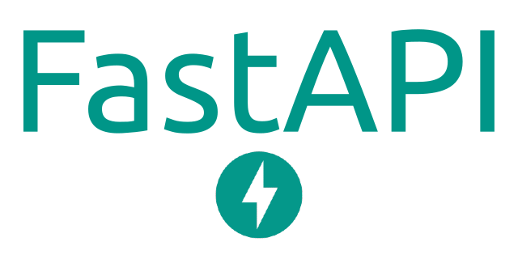

    
    

# Comment Toxicity Classification App with React and FastAPI
The application recieves input text in the client-side and sends it to FastAPI for prediction using Tensorflow.

## Data:
**Jigsaw** Dataset on <a href='https://www.kaggle.com/competitions/jigsaw-toxic-comment-classification-challenge/data'>Kaggle</a>

| Classes   |
|----------|
| Toxic |  
| severe_toxic | 
| obscene |
| threat |
| insult |
| identity_hate |

## Working App

